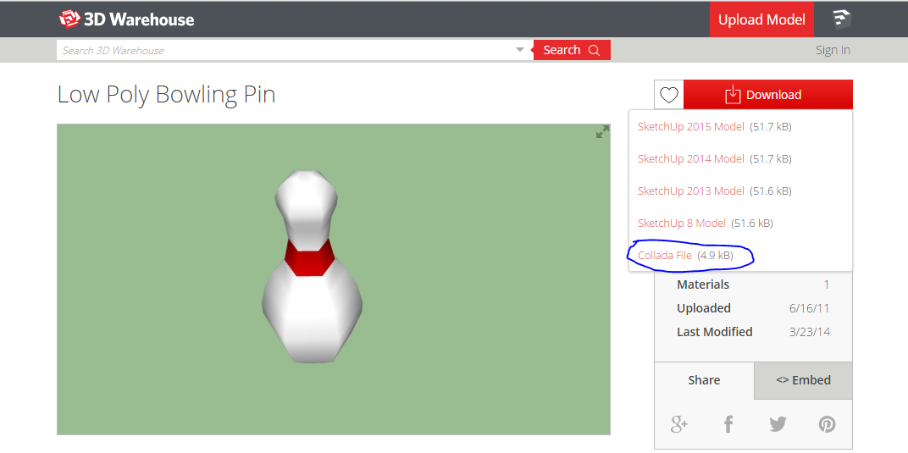
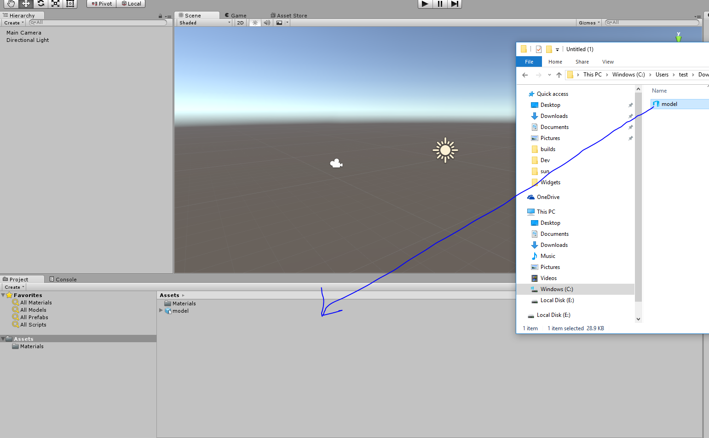
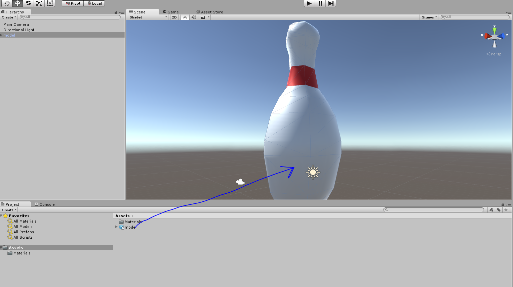
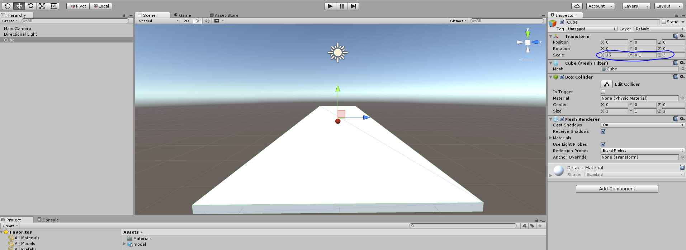
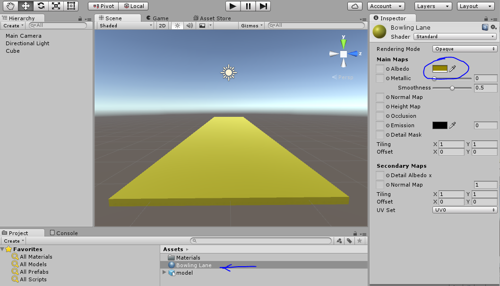
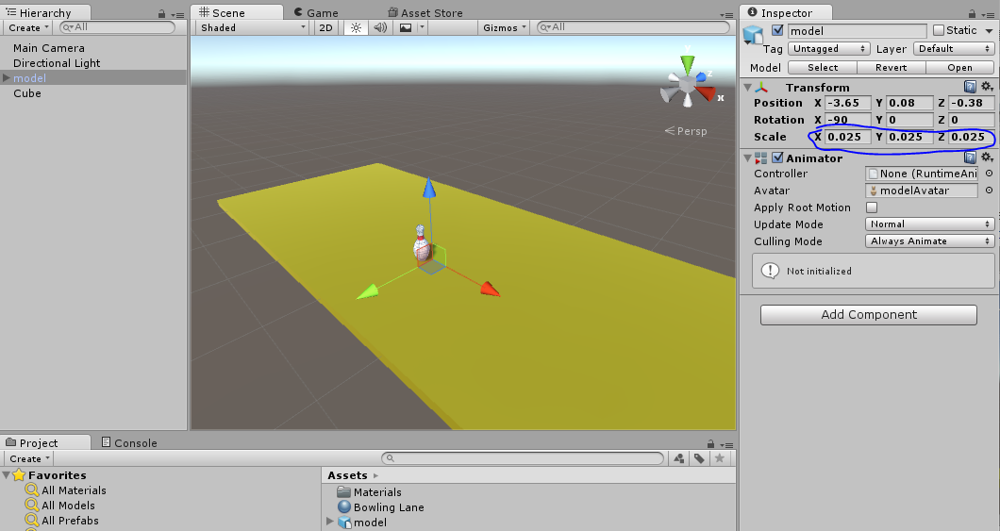
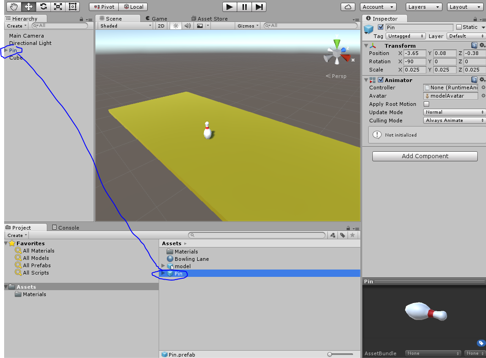
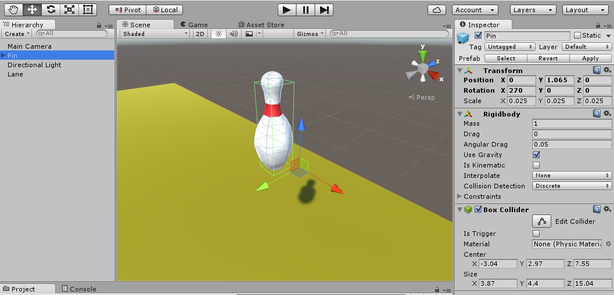
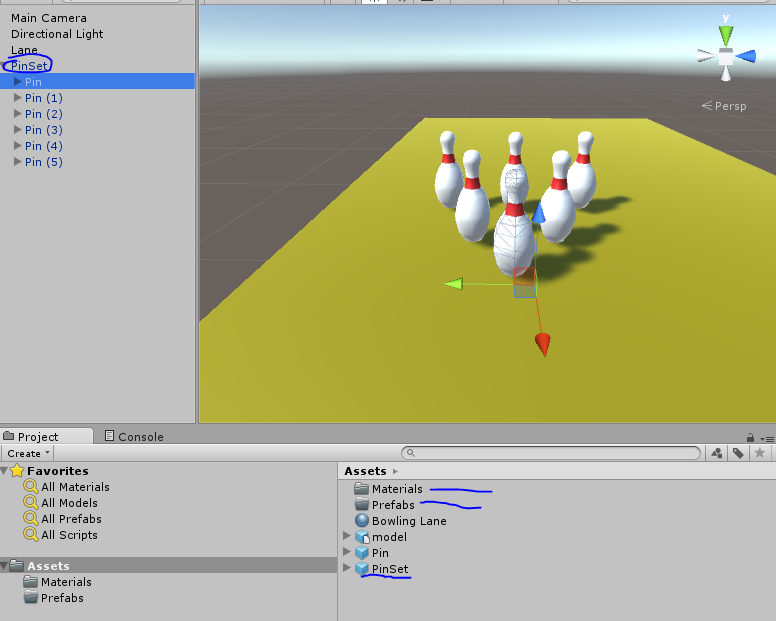

Time for another fantastic tutorial, this time we will be Bowling!

First of all, let’s learn how to get some awesome assets for our bowling game.  We can of course use a sphere for our ball, and we can build a lane out of a cube, but what about the pins?

We could use a capsule, but that isn’t really accurate.  So I want you to open a web browser right now and go to the sketchup 3d warehouse where we can get a free bowling pin model.

[https://3dwarehouse.sketchup.com/model.html?id=9ad3782c82b1e1ba70d6f696167a3190](https://3dwarehouse.sketchup.com/model.html?id=9ad3782c82b1e1ba70d6f696167a3190)

This link has a bowling pin that only has 80 polygons, always mind the number of polygons as higher means more complex, which is more expensive to render.

Unity supports Collada files, so click the red Download button and save the Collada file to your computer.  Then extract the zip file somewhere so you can find model.dae.

Now you will want to make a new Unity Project called Bowling.

Drag the Collada file into your project like this:

Now you should have a model prefab in your assets folder.  This is your bowling pin, if you drag it on the stage you will see a giant bowling pin rendered to the screen:

This bowling pin is too big.  In order to understand the scale it should be let’s build our lane.  Delete the pin, the create a cube and stretch it to be long and skinny, like a bowling lane:

Set the cubes scale to 15,0.1,3
This will create a nice surface to bowl on.

Now let’s make a material for this bowling lane, we can just use the standard unity shader, set the Albedo color to a brown or gold and drag the material to the cube to assign it:

Now if you drag the bowling pin out again you will notice it is gigantic.  You will want to shrink it down by setting it’s scale to something more manageable. Set it’s scale to 0.025 for all 3 axis:

Now you will want to arrange the pin at the back of the lane and make a new prefab for this pin, give the pin a name in the Hierarchy view and drag it into your project to make a prefab:

Making a prefab will record the size of the model and make it easier to make changes to entire groups of pins at one time.  We are going to make a number of changes, and it will be good to do this to the prefab instead of to a single pin at a time.

Now let’s make the pin respond to physics, add a RigidBody component, and a Box Collider to the pin.  You will want to resize the box collider so that it is the same size as the pin:

Now duplicate the pin over and over the make the expected pin layout. 

