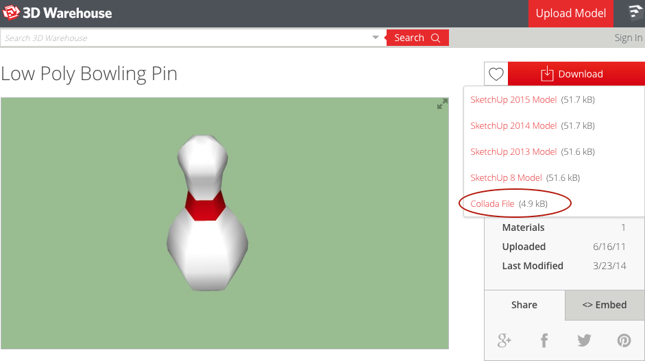
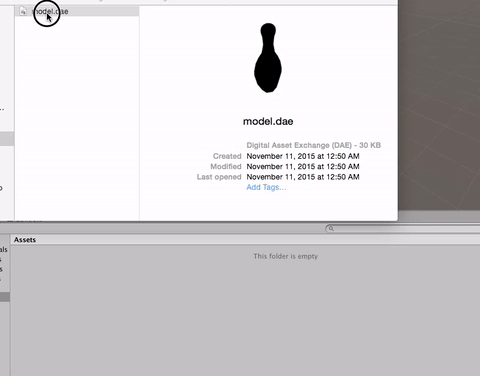
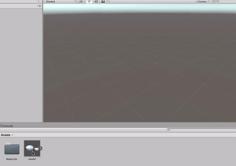
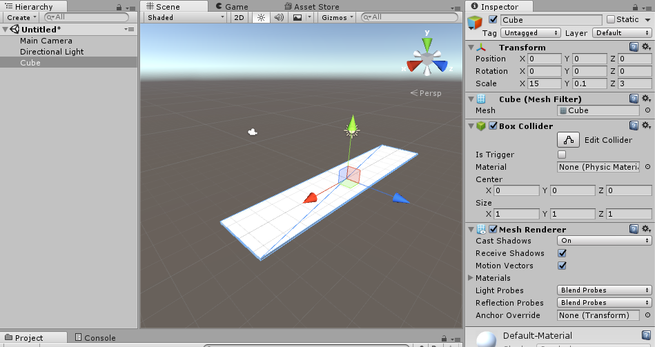
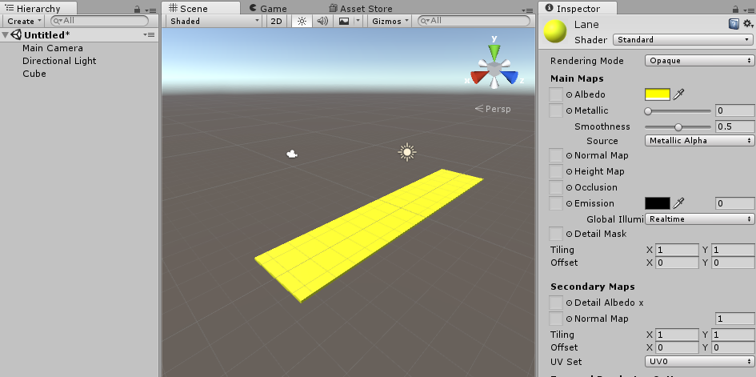
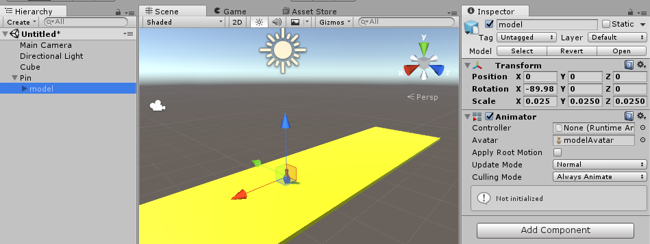
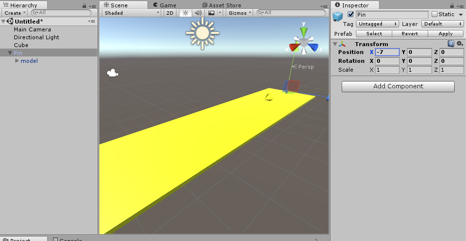
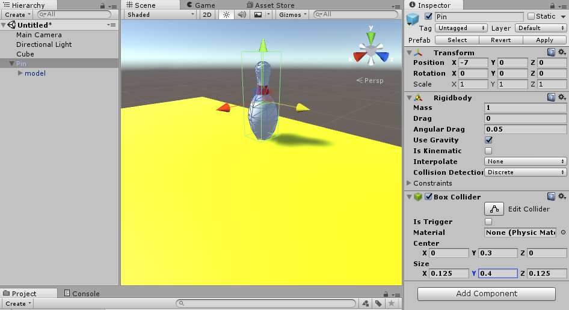
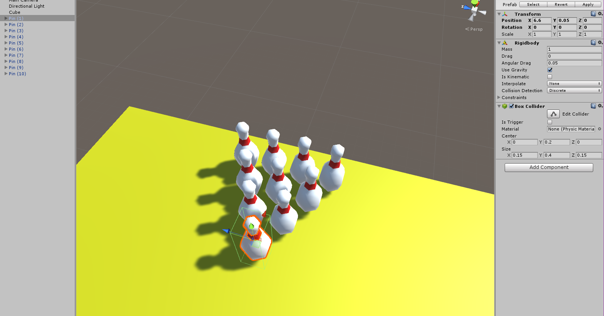

Time for another fantastic tutorial, this time we create a full VR Bowling game!

First of all, let’s learn how to get some awesome assets for our bowling game. We can use a sphere for our ball, and we can build a lane out of a cube, but what about the pins?

We could use a capsule, but that isn’t accurate...

We're going to get some free models from the Sketchup 3D Warehouse. You can use the Unity Asset Store to find models, but if you can't find what you need there, you can also look elsewhere. Be sure to always check licensing information on models you find from sources other than the Unity Asset Store! We'll go over copyright briefly later in the course.

> [action]
>
Go to the [Sketchup 3D Warehouse](https://3dwarehouse.sketchup.com/model.html?id=9ad3782c82b1e1ba70d6f696167a3190) to get a free bowling pin model.
>
Unity supports Collada files, so click the red Download button and save the Collada file to your computer. Then extract the zip file somewhere so you can find model.

This link has a bowling pin with 80 polygons. Always mind a higher number of polygons means more complex, which is more expensive to render.

# Create a project

> [action]
>
Now make a new 3D Unity Project called "Bowling."
>
Drag the Collada file into your project
?

Now you should have a model prefab in your assets folder. This is your bowling pin. If you drag it on the Scene View you will see a giant bowling pin rendered to the screen.

# Scale away!

This bowling pin is too big. Let’s build the lane and then adjust the bowling pin to an appropriate size.

> [action]
>
Delete the pin if you dragged on in, then create a cube and stretch it to be long and skinny, like a bowling lane. We used a scale of `(15,0.1,3)`.
>

This will give you a nice surface to bowl on.

> [action]
>
Now let’s create a new material for this bowling lane. Use the standard unity shader, set the Albedo color to a brown or gold and drag the material to the cube to assign it.
>

Now if you drag the bowling pin out again you will notice it's gigantic. You will want to shrink it down by setting it’s scale to something more manageable.

> [action]
>
Set its scale to `0.025` for all 3 axes, create an `Empty Game Object` called `Pin`, and drag this model inside. We do this rather than scaling down our pin so that we can think of our Pin Prefab as scaled to `(1,1,1)`. This will come in handy later.
>

<!-- -->

> [action]
>
Now place this pin at the back of the lane and make a new Prefab for this pin. As a refresher on how to make the Pin a new Prefab, give the pin a name in the Hierarchy panel and drag it into your Project panel.
>

Making a prefab will record the size of the model and make it easier to make changes to entire groups of pins at one time. We are going to make a few changes, and it will be good to do this once for the prefab instead of once for each pin at a time.

# Give it a body

Now, let’s make the pin respond to physics and collide with other objects.

> [action]
>
Add a Rigidbody component, and a Box Collider to the pin. You will want to resize the box collider so that it's the same size as the pin. It may make your life easier to move the model inside of pin so it's actually centered in the parent object. We found `(0.1, 0, 0.05)` worked well for us.
>
Make sure to hit `Apply` when you're done to update the prefab!
>

<!-- -->

> [info]
>
We could have used 3 convex Mesh Colliders (one for each mesh) if we had wanted more accurate collisions, but Mesh Colliders are expensive, and a Box Collider is good enough for what we want to be able to do.

<!-- -->

> [action]
>
Now duplicate the pin over and over the make the expected pin layout at the end of the lane.
>

