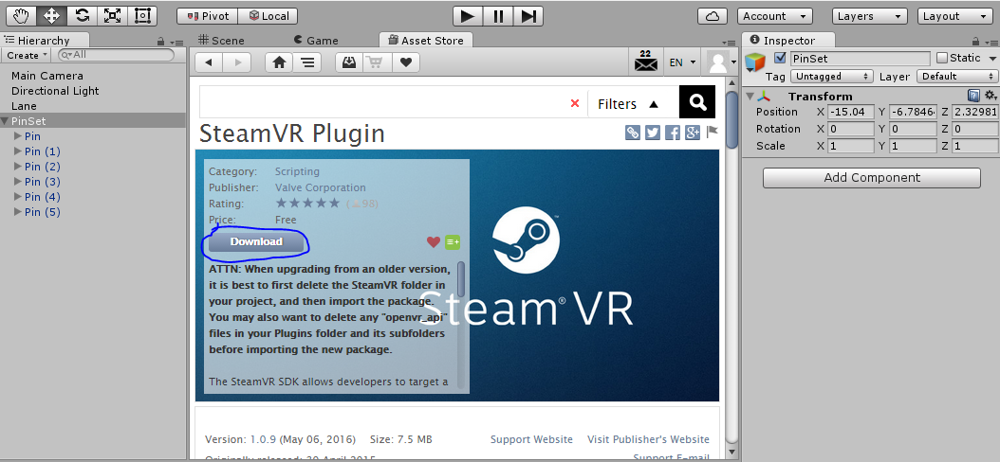
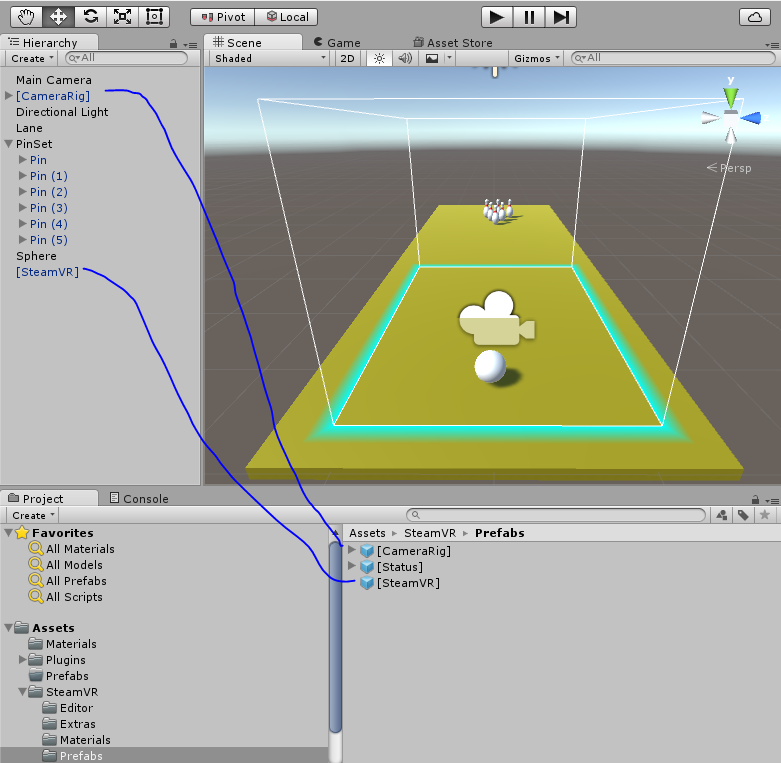
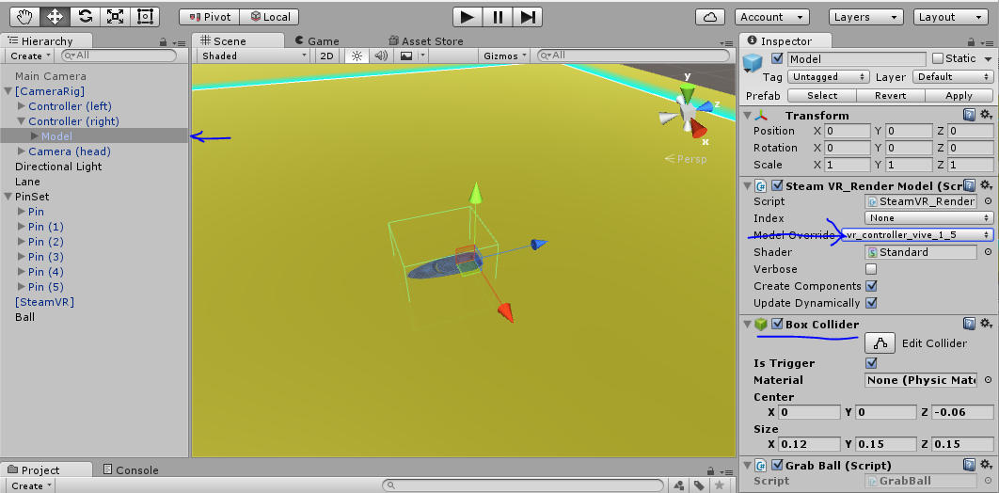
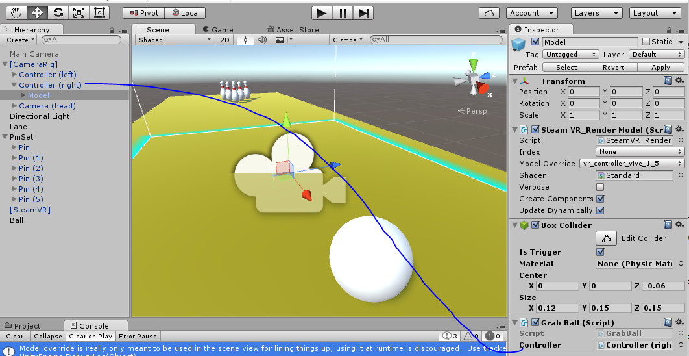
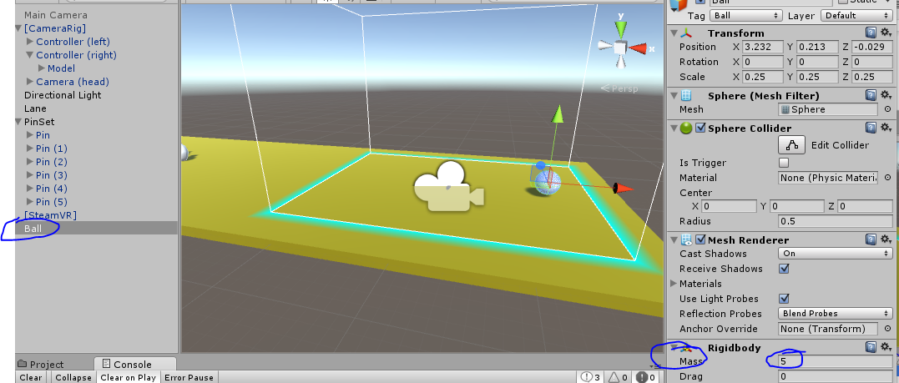

>[action]
>Now create a sphere and place it at the base of your lane. This will be our ball.  

We will get back to this in a moment.

Now we are going to need to import SteamVR into the project so that we can get the hand controllers and control our HMD.

>[action]
>Open the Asset Store then search for SteamVR and Download and import it.


<!-- -->

>[action]
>Once it is done downloading, please import it into your project, and then find the SteamVR folder under Assets.  Drag a [SteamVR] component and a [CameraRig] component to the scene.


The glowing blue box will be your walking play area.  You will be able to walk around this region and interact with objects inside of it.  For now we will only have the ball in our region of view.  We will also want to make the lane slightly shorter, so adjust it’s X scale to 8 instead of 15, this will put us closer to the pins.  

#Throwing the Ball

Now we can make the ball grab-able and add physics to it.

>[action]
>Attach a Rigidbody to the sphere and name it Ball.  Make this into a Prefab as well.

If we go into the [CameraRig] object in the Scene, you will see that it has an Object for the left controller and the right controller.  You can expand these further to see the models that are attached to each controller.

>[action]
>Update the Model Override to point to the controller_vive so that people can see themselves holding a vive controller in the world.  Then add a box collider to this Model so that we can use it to collide with our ball.  Make sure that Is Trigger is checked on the box collider. Is Trigger will ensure that when our hand collides with the ball it wont knock the ball around, it will only fire off a Trigger Enter so that we can decide what to do.


Now we will add a new script called Grab Ball.  The contents of the script are below, we will go through what each part of the script does together.  This script will allow you to grab the ball and throw it.

```
public class GrabBall : MonoBehaviour {
    public SteamVR_TrackedObject controller;  //Reference to the controller
    private GameObject selectedObject;
    private GameObject grabbedObject;

    void OnTriggerEnter(Collider other)
    {
        selectedObject = other.gameObject; //Select an object by touching it
    }

    void OnTriggerExit(Collider other)
    {
       if(selectedObject == other.gameObject)
        {
            selectedObject = null; //Deselect the last object you touched
        }
    }

    void FixedUpdate()
    {
        //Get a reference to the steam controller we drag to the script:
        SteamVR_Controller.Device device = SteamVR_Controller.Input((int)controller.index);
        //If we have a grabbedObject selected then align it with the transform.position.
        if (grabbedObject != null)
        {
            grabbedObject.transform.position = this.gameObject.transform.position;
        }
        //If you press the trigger down while an object is selected and not grabbed,
        //Mark the object as grabbed and move it to the hand.
        if ((selectedObject != null && grabbedObject == null) && device.GetTouchDown(SteamVR_Controller.ButtonMask.Trigger))
        {
            grabbedObject = selectedObject;
            grabbedObject.transform.position = this.gameObject.transform.position;
        }
        else if (grabbedObject != null && device.GetTouchUp(SteamVR_Controller.ButtonMask.Trigger))
        {
            //If we let go of the trigger while an object is grabbed then apply physics
            var rigidbody = grabbedObject.GetComponent<Rigidbody>();
            //Apply the current device velocity to the object to throw it, we multiply 4 to make it
            //Easier to throw.              
            rigidbody.velocity = grabbedObject.transform.TransformVector(device.velocity*4);

            //Apply the angular velocity from the device as well, also multiply by 4.            
            rigidbody.angularVelocity = grabbedObject.transform.TransformVector(device.angularVelocity*4);
            rigidbody.maxAngularVelocity = rigidbody.angularVelocity.magnitude;

            //Now that the object has been thrown lets reset selection and grabbedObject so that we can select a new object!
            selectedObject = null;
            grabbedObject = null;
        }
    }
}
```

>[action]
>Now you can drag the Controller to the script like this:

This will allow us to access the controller in the script.

<!-- -->

>[action]
Now let’s make the ball much higher mass than the pins so that it will knock them around.
Click the Ball GameObject and increase its mass to 5.


Now if we go into the game we should be able to walk up to the ball, grab it with our hands and throw it at the pins!

If it hits the pins it will knock them over!  Super cool huh?

This is far from a complete bowling game, now we will need to add scoring, turns, pin reset, and ball reset.

If you're up for a challenge, try adding the following:

- scoring
- turns with pin and ball resets

To complete the game, you can make some simpler additions, like adding gutters on the edges, and a more realistic texture for the floor and Skybox.
